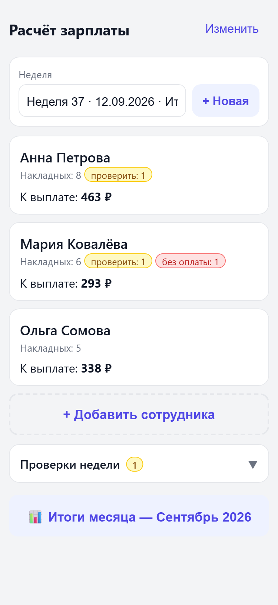
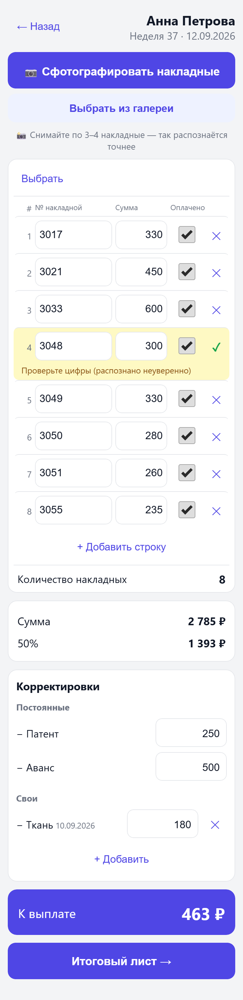
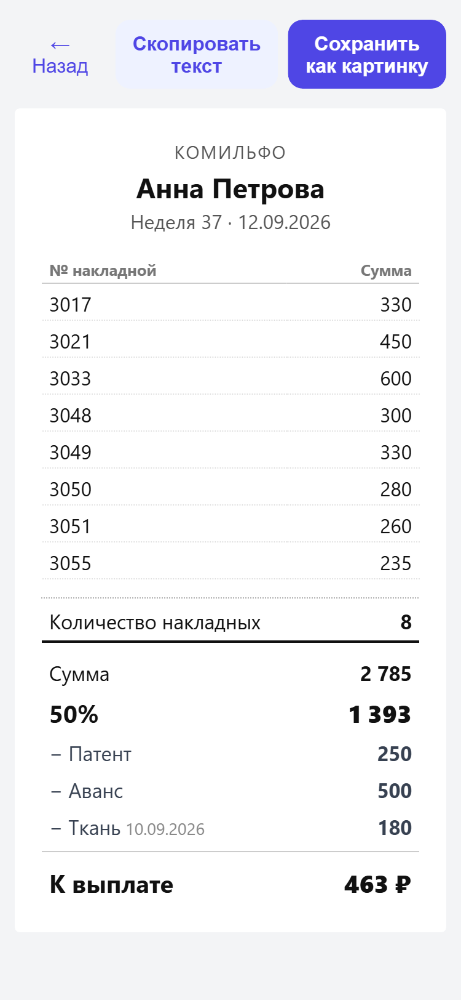

# Зарплата — Ателье (weekly payroll app)

Mobile-first PWA that calculates each employee's weekly pay from photographed
invoices ("накладные"): photograph → auto-read (Claude vision) → verify →
auto-calculate → clean hand-back sheet. Single operator (the shop owner),
Russian UI. Runs hosted on Vercel, or locally on any machine.

## Screenshots

<table>
  <tr>
    <td align="center" width="33%"></td>
    <td align="center" width="33%"></td>
    <td align="center" width="33%"></td>
  </tr>
  <tr>
    <td align="center"><b>Week overview</b><br>Payout per employee, with badges for rows that still need checking or have no paid stamp.</td>
    <td align="center"><b>Invoice review</b><br>Rows read off the photo. Low-confidence reads are highlighted for a second look.</td>
    <td align="center"><b>Payout sheet</b><br>The hand-back sheet, mirroring the shop's paper layout. Saves as an image or copies as text.</td>
  </tr>
</table>

<sub>Screenshots use invented names and amounts, not real shop data.</sub>

## Stack

- **Frontend:** React + Vite, installable PWA (manifest + service worker), camera via `getUserMedia` / `<input capture>`
- **Backend:** Node.js + Express; holds the vision API key server-side and proxies photo-reading requests
- **Storage (dual-mode, chosen at runtime by env vars):**
  - _Local:_ SQLite via Node's built-in `node:sqlite` (`data/payroll.db`), photos on disk (`data/photos/`)
  - _Cloud (Vercel):_ [Turso](https://turso.tech) (hosted libSQL) + [Vercel Blob](https://vercel.com/storage/blob) for photos
- **Vision (multi-provider, chosen by the `VISION_MODEL` name):**
  - `claude-*` → Anthropic Messages API · `gemini-*` → Google Gemini API · `vendor/model` (with a slash) → OpenRouter
  - Production default: `anthropic/claude-sonnet-5` (via OpenRouter) with `gemini-2.5-flash` as a free fallback
  - Fallback chain via `VISION_FALLBACK_MODELS`; if every model fails, the photo becomes a flagged manual-entry row (never a confident-but-wrong number)

## Run it

### Hosted on Vercel (production)

The app is deployed on Vercel and reachable at a public HTTPS URL, so it works
without the owner's computer being on. Cloud mode activates when these
environment variables are set on the project:

- `TURSO_DATABASE_URL`, `TURSO_AUTH_TOKEN` — the Turso database
- `BLOB_READ_WRITE_TOKEN` — Vercel Blob (auto-added when a Blob store is connected)
- `VISION_MODEL`, `VISION_FALLBACK_MODELS`, plus the relevant vision key (`OPENROUTER_API_KEY` / `GEMINI_API_KEY` / `ANTHROPIC_API_KEY`)
- `APP_PIN` (open the app), `SHOP_NAME` (printed on the sheet)

Push to `master` triggers an automatic build + deploy (`vercel.json` builds the
client; `api/index.js` serves the Express app as a serverless function).
`tools/migrate-to-cloud.js` (`npm run migrate`) does a one-time copy of a local
database and photos into Turso + Blob.

### Local (development or a self-hosted box)

1. Install and build:

   ```
   npm install
   npm --prefix client install
   npm run icons
   npm run build
   ```

2. Create `.env`:
   - a vision key — `OPENROUTER_API_KEY` (Claude/Gemini via OpenRouter), `GEMINI_API_KEY`, or `ANTHROPIC_API_KEY`
     (the app also works with none — invoices are then typed manually)
   - `VISION_MODEL` / `VISION_FALLBACK_MODELS` — which model(s) to use
   - `APP_PIN` — the PIN to open the app (change from the default!)
   - `SHOP_NAME` — printed on the payout sheet

   Leave the `TURSO_*` / `BLOB_*` variables unset to run in local mode (SQLite + disk).

3. Start:

   ```
   npm start
   ```

   Listens on `http://0.0.0.0:3000`. Open it from a phone via the machine's LAN
   address (e.g. `http://192.168.1.20:3000`) and use "Add to Home screen" to
   install it.

## How it maps to the paper process

- Each employee hands in a stack of invoices weekly. The owner photographs them
  (a few stubs per photo — the app suggests 3–4 for best accuracy), the backend
  reads `№ накладной`, `Итого` and the red «ОПЛАЧЕНО» stamp.
- Every read row is shown for confirmation. The just-scanned batch floats to the
  top of the list, grouped under a thumbnail of its photo, so the operator can
  check the numbers against the paper without hunting. Low-confidence reads are
  highlighted yellow; rows without the paid stamp are highlighted red and
  excluded from the sum (but stay visible).
- Sum ÷ 2 (the "50%"), minus standing deductions (Патент, Аванс), plus/minus
  one-off adjustments → «К выплате».
- The summary sheet mirrors the notebook layout and can be saved as an image or
  copied as text. A monthly view totals each employee's 50% across the month's weeks.
- Weekly checks across all employees: duplicate invoice numbers (a number is
  unique shop-wide) and unpaid invoices.

## Notes

- Employees are never deleted, only archived — past weeks stay intact.
- All numbers are integers (rubles, no kopecks).
- Original photos are kept (on disk locally, in Vercel Blob in the cloud) so any
  row can be re-checked against the source.
- The PIN is a convenience lock for a single operator, not hard security; the app
  re-asks it after a period of inactivity.
- **Back up your data.** Local mode: back up the `data/` folder. Cloud mode: the
  records live in Turso and the photos in Vercel Blob.
